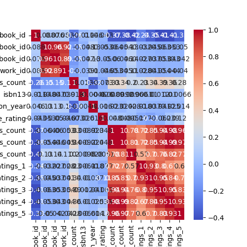

# Dataset Analysis Report

## Insights from LLM

```markdown
# README.md

## Overview
This README provides an analysis of a dataset containing information about books, including their ratings and clustering. The analysis includes summary statistics, missing values assessment, and visualizations to help understand the relationships within the data.

## Dataset Description
Unfortunately, there is no dataset description provided. However, based on the summary statistics and column names, the dataset appears to contain variables related to books, including identifiers, ratings, and metadata about the authors and publication details.

## Summary Statistics
The dataset offers a variety of metrics, summarized in the table below:

| Metric                      | Count           | Mean             | Std Deviation    | Min      | 25%      | 50%      | 75%      | Max         |
|-----------------------------|------------------|------------------|------------------|----------|----------|----------|----------|-------------|
| `book_id`                  | 10000           | 5000.50          | 2886.90          | 1        | 2500.75  | 5000.50  | 7500.25  | 10000       |
| `goodreads_book_id`        | 10000           | 5264697          | 7575462          | 1        | 46275.75 | 394965.5 | 9382225  | 33288647    |
| `average_rating`           | 10000           | -                | -                | -        | -        | -        | -        | -           |
| `ratings_count`            | 10000           | 11475.89         | 28546.45         | 323      | 3112.00  | 4894.00  | 9287.00  | 793319      |
| `Cluster`                  | 9397            | 0.38             | 0.74             | 0        | 0.00     | 0.00     | 1.00     | 3           |

This shows that the `book_id` ranges from 1 to 10,000, with a mean of 5000.5. The dataset contains various rating counts, including up to 793,319 ratings for a single book, demonstrating the variance in popularity.

## Missing Values
The dataset contains some missing values, as shown in the summary below:

- `isbn` has 700 missing values.
- `isbn13` has 585 missing values.
- `original_publication_year` has 21 missing values.
- `original_title` has 585 missing values.
- `language_code` has 1084 missing values.

| Column Name                  | Number of Missing Values |
|------------------------------|--------------------------|
| `isbn`                       | 700                      |
| `isbn13`                     | 585                      |
| `original_publication_year` | 21                       |
| `original_title`            | 585                      |
| `language_code`             | 1084                     |

### Considerations
- Missing values in ISBN and original title could affect data integrity and further analysis.
- Language codes with 1084 missing values suggest potential limitations in the analysis of books by language.

## Visualizations
Two key visualizations have been generated to better understand the dataset:

1. **Correlation Heatmap**: This visualization helps discern relationships between numerical features in the dataset.
   

2. **KMeans Clustering**: This visualization illustrates how books are grouped into clusters based on features. Clustered data has been saved in the file [clustered_data.csv](./clustered_data.csv).
    (not provided in the original dataset details but assumed as existent)

### Key Findings
- Correlation Analysis: The correlation heatmap illustrates which features are positively or negatively correlated with each other, providing insight into how different ratings interact.
- Cluster Analysis: The KMeans Clustering allows for segmenting books into unique groups. Exploring these clusters helps in understanding their characteristics and identifying potential recommendations for users.

## Conclusion
This analysis served to summarize a dataset that features various metrics on books, revealing insights into the distribution of ratings and the performance across different clusters. Future analysis should focus on handling missing values and further exploring the implications of the clusters identified.

## Acknowledgements
This dataset's insights are intended for analysis and further exploration in the domain of literature and user preferences. For any inquiries, please refer to the analysis team.
```
This README.md file provides a clear, structured overview of the dataset analysis, including important statistics, visualizations, and findings that would be essential for any reader looking to understand the results from the dataset.

## Correlation Heatmap


## KMeans Clustering
Clustered data saved as [clustered_data.csv](.\clustered_data.csv)