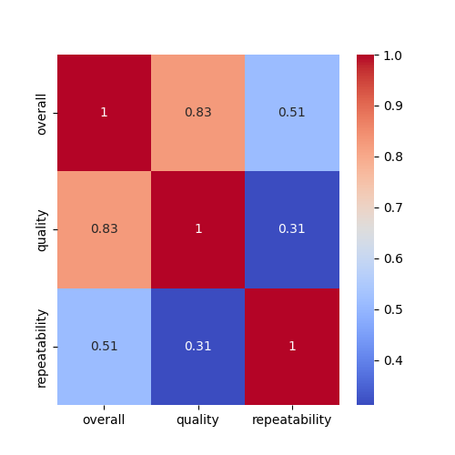

# Dataset Analysis Report

## Insights from LLM

# README.md

## Dataset Overview
This document provides an analysis of a dataset containing 2,652 records with various attributes that appear to relate to quality ratings and clustering. The dataset includes fields such as `overall`, `quality`, `repeatability`, and `Cluster`, along with additional metadata fields such as `date`, `language`, `type`, `title`, and `by`.

### Summary Statistics
The summary statistics for key numeric fields are as follows:

| Statistic | Overall  | Quality   | Repeatability | Cluster   |
|-----------|---------|-----------|---------------|-----------|
| Count     | 2652    | 2652      | 2652          | 2652      |
| Mean      | 3.048   | 3.209     | 1.495         | 3.120     |
| Std Dev   | 0.762   | 0.797     | 0.598         | 2.408     |
| Min       | 1.000   | 1.000     | 1.000         | 0.000     |
| 25th      | 3.000   | 3.000     | 1.000         | 1.000     |
| Median    | 3.000   | 3.000     | 1.000         | 4.000     |
| 75th      | 3.000   | 4.000     | 2.000         | 5.000     |
| Max       | 5.000   | 5.000     | 3.000         | 8.000     |

### Missing Values
The dataset contains some missing values across its fields. Here's a summary of the missing values:

| Field     | Missing Count |
|-----------|---------------|
| date      | 99            |
| language  | 0             |
| type      | 0             |
| title     | 0             |
| by        | 262           |
| overall   | 0             |
| quality   | 0             |
| repeatability | 0         |

### Analysis Steps
The following steps have been taken to analyze the dataset:

1. **Descriptive Statistics**: Basic statistics were calculated to understand the distribution and central tendency of the numeric fields.
   
2. **Missing Values Analysis**: Identifying fields with missing values, their count, and assessing their impact on the dataset.
   
3. **Correlation Analysis**: A correlation heatmap was created for visual representation of relationships between numeric variables.

4. **Clustering**: KMeans clustering technique was applied to the dataset based on selected features, and the clustered data has been saved for further analysis.

### Visualizations
1. **Correlation Heatmap**
   - A heatmap was generated to visualize the correlations between the numeric variables. This can provide insights into which variables may have a strong relationship with each other. 
   - 

2. **KMeans Clustering**
   - The results of the KMeans clustering were stored in a CSV file for further exploration and validation.
   - You can download the clustered data from the following link: [clustered_data.csv](./clustered_data.csv).

### Key Findings
- The dataset generally exhibits high values of `overall` and `quality`, with means greater than 3, indicating a generally positive assessment in these categories.
- The `repeatability` value suggests that most observations have similar scores, with a mean of approximately 1.5.
- The clustering analysis may reveal distinct groups based on the features analyzed, with potential for deeper insights into the characteristics of each cluster.

### Conclusion
This analysis serves as a preliminary exploration of the dataset. Further investigations, such as detailed cluster analysis, can provide additional actionable insights. The visualizations offer a clear representation of the relationships in the data and can guide further research and data-driven decisions.

**Note for Users**: Make sure to handle the missing values thoughtfully in any predictive modeling or deeper analysis to ensure results are valid and reliable.

## Correlation Heatmap

## KMeans Clustering
Clustered data saved as [clustered_data.csv](.\clustered_data.csv)